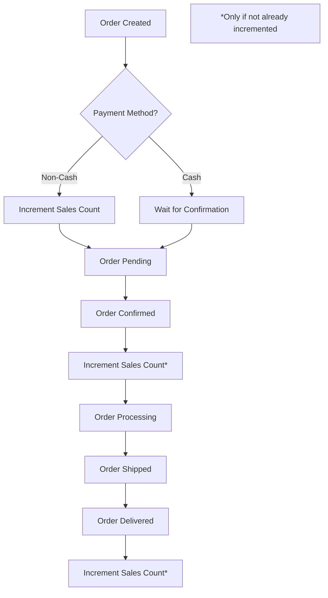

# Product Dynamic Categorization System

## Overview

This system automatically categorizes products into four dynamic categories based on real-time data and configurable thresholds:

- **Top Selling** - Products with high sales volume
- **Trending** - Products with high views and recent sales activity
- **Recently Added** - Products created within a specified timeframe
- **Top Rated** - Products with high customer ratings

## Database Schema Changes

### New Columns Added to `products` Table

| Column | Type | Default | Description |
|--------|------|---------|-------------|
| `salesCount` | int | 0 | Total number of sales for this product |
| `viewCount` | int | 0 | Total number of views for this product |
| `isTopSelling` | boolean | false | Flag indicating if product is top selling |
| `isTrending` | boolean | false | Flag indicating if product is trending |
| `isRecentlyAdded` | boolean | false | Flag indicating if product was recently added |
| `isTopRated` | boolean | false | Flag indicating if product is top rated |

### Migration

```typescript
// Migration file: 1730000000000-AddProductCategorizationColumns.ts
// Adds all new columns with proper defaults
// Automatically sets initial values for existing products
```

## Entity Methods

### Product Entity (`product.entity.ts`)

#### Core Update Methods

```typescript
// Update top selling status based on sales threshold
updateTopSelling(threshold: number = 100): void

// Update trending status based on view and sales thresholds
updateTrending(viewThreshold: number = 500, salesThreshold: number = 50): void

// Update recently added status based on creation date
updateRecentlyAdded(daysThreshold: number = 7): void

// Update top rated status based on rating threshold
updateTopRated(ratingThreshold: number = 4.0): void

// Update all categories at once with configurable options
updateAllCategories(options?: CategoryOptions): void
```

#### Utility Methods

```typescript
// Get array of active category strings
get categories(): string[]
// Returns: ['top-selling', 'trending', 'recently-added', 'top-rated']
```

#### Default Thresholds

- **Top Selling**: 100+ sales
- **Trending**: 500+ views AND 50+ sales
- **Recently Added**: Created within 7 days
- **Top Rated**: Rating ≥ 4.0

## Service Methods

### Product Service (`product.service.ts`)

#### Automatic Category Updates

All CRUD operations automatically update categories:

```typescript
// ✅ Auto-updates categories on creation
async create(dto: CreateProductDto): Promise<Product>

// ✅ Auto-updates categories on update
async updateCustom(id: string, dto: UpdateProductDto): Promise<Product>

// ✅ Auto-updates categories on sales increment
async incrementSalesCount(id: string): Promise<Product>

// ✅ Auto-updates categories on view increment
async incrementViewCount(id: string): Promise<Product>

// ✅ Auto-updates categories on rating change
async updateProductRating(id: string, newRating: number): Promise<Product>
```

#### Manual Category Management

```typescript
// Update categories for single product with custom thresholds
async updateProductCategories(id: string, options?: CategoryOptions): Promise<Product>

// Bulk update all products categories
async updateAllProductsCategories(options?: CategoryOptions): Promise<void>

// Query products by specific category
async getProductsByCategory(category: CategoryType): Promise<Product[]>
```

#### CategoryOptions Interface

```typescript
interface CategoryOptions {
  topSellingThreshold?: number;      // Default: 100
  trendingViewThreshold?: number;    // Default: 500
  trendingSalesThreshold?: number;   // Default: 50
  recentlyAddedDays?: number;        // Default: 7
  topRatedThreshold?: number;        // Default: 4.0
}
```

## API Endpoints

### Product Controller (`product.controller.ts`)

#### Public Endpoints

```http
# Get products by category
GET /api/products/category/:category
# Categories: top-selling | trending | recently-added | top-rated

# Increment view count (public - no auth required)
POST /api/products/:id/view
```

#### Authenticated Endpoints

```http
# Increment sales count (requires auth)
POST /api/products/:id/sale
Authorization: Bearer <token>

# Update product categories manually (admin only)
PATCH /api/products/:id/categories
Authorization: Bearer <token>
Content-Type: application/json
{
  "topSellingThreshold": 150,
  "trendingViewThreshold": 1000,
  "topRatedThreshold": 4.5
}

# Bulk update all product categories (admin only)
POST /api/products/update-all-categories
Authorization: Bearer <token>
Content-Type: application/json
{
  "topSellingThreshold": 200,
  "trendingViewThreshold": 800
}
```

## Usage Examples

### Frontend Integration

#### Get Trending Products

```javascript
// Fetch trending products
const response = await fetch('/api/products/category/trending');
const trendingProducts = await response.json();
```

#### Track Product Views

```javascript
// Increment view count when user views product
const trackView = async (productId) => {
  await fetch(`/api/products/${productId}/view`, {
    method: 'POST'
  });
};
```

#### Track Sales

```javascript
// Increment sales count when order is completed
const trackSale = async (productId, authToken) => {
  await fetch(`/api/products/${productId}/sale`, {
    method: 'POST',
    headers: {
      'Authorization': `Bearer ${authToken}`
    }
  });
};
```

### Admin Operations

#### Custom Threshold Updates

```javascript
// Update categories with custom thresholds
const updateCategories = async (productId, authToken) => {
  await fetch(`/api/products/${productId}/categories`, {
    method: 'PATCH',
    headers: {
      'Authorization': `Bearer ${authToken}`,
      'Content-Type': 'application/json'
    },
    body: JSON.stringify({
      topSellingThreshold: 150,
      trendingViewThreshold: 1000,
      topRatedThreshold: 4.5
    })
  });
};
```

## Automatic Updates Triggers

### When Categories Are Updated

| Operation | Triggers | Categories Updated |
|-----------|----------|-------------------|
| Product Creation | `create()` | All categories |
| Product Update | `updateCustom()` | All categories |
| Sales Increment | `incrementSalesCount()` | Top Selling, Trending |
| View Increment | `incrementViewCount()` | Trending |
| Rating Update | `updateProductRating()` | All categories |
| **Order Created** | `createOrder()` (non-cash payments) | Top Selling, Trending |
| **Order Confirmed** | `updateOrderStatus()` → CONFIRMED | Top Selling, Trending |
| **Order Delivered** | `updateOrderStatus()` → DELIVERED | Top Selling, Trending |

### Real-time Updates

The system automatically updates categories in real-time when:

1. **New Product Created** → `isRecentlyAdded` set to `true`
2. **Product Viewed** → `viewCount` incremented, `isTrending` recalculated
3. **Product Sold** → `salesCount` incremented, `isTopSelling` and `isTrending` recalculated
4. **Rating Changed** → `isTopRated` recalculated
5. **Product Updated** → All categories recalculated
6. **Order Created** (non-cash) → `salesCount` incremented for all order items
7. **Order Status Changed** (CONFIRMED/DELIVERED) → `salesCount` incremented for all order items

## Order Integration

### Automatic Sales Tracking

The system automatically tracks sales and updates product categories when orders are processed:

#### Order Creation (`OrderService.createOrder()`)
```typescript
// For non-cash payments (credit card, digital wallet, etc.)
// Sales count is incremented immediately
if (createOrderDto.paymentMethod && createOrderDto.paymentMethod !== 'cash') {
  await this.incrementSalesCountForOrderItems(orderItemsToSave);
}
```

#### Order Status Updates (`OrderService.updateOrderStatus()`)
```typescript
// Sales count incremented when order is confirmed or delivered
if (status === OrderStatus.CONFIRMED || status === OrderStatus.DELIVERED) {
  await this.incrementSalesCountForOrderItems(orderWithItems.items);
}
```

### Sales Count Logic

- **Quantity-based**: Each item quantity contributes to sales count
- **Product-level**: Sales count is tracked per product, not per variant
- **Automatic categorization**: Top Selling and Trending categories update automatically
- **Error handling**: Sales count updates won't fail the order process

### Order Status Flow



### Integration Points

| Order Event | Product Action | Categories Affected |
|-------------|----------------|-------------------|
| Order Created (non-cash) | Increment `salesCount` | Top Selling, Trending |
| Order Confirmed | Increment `salesCount` | Top Selling, Trending |
| Order Delivered | Increment `salesCount` | Top Selling, Trending |
| Order Cancelled | No action | None |

## Performance Considerations

### Indexing Recommendations

```sql
-- Add indexes for better query performance
CREATE INDEX idx_products_top_selling ON products(isTopSelling) WHERE isTopSelling = true;
CREATE INDEX idx_products_trending ON products(isTrending) WHERE isTrending = true;
CREATE INDEX idx_products_recently_added ON products(isRecentlyAdded) WHERE isRecentlyAdded = true;
CREATE INDEX idx_products_top_rated ON products(isTopRated) WHERE isTopRated = true;
CREATE INDEX idx_products_sales_count ON products(salesCount);
CREATE INDEX idx_products_view_count ON products(viewCount);
```

### Bulk Operations

For better performance with large datasets:

```typescript
// Use bulk update for all products (admin operation)
await productService.updateAllProductsCategories({
  topSellingThreshold: 200,
  trendingViewThreshold: 1000
});
```

## Configuration

### Environment Variables

You can add these to your `.env` file for global defaults:

```env
# Product categorization defaults
PRODUCT_TOP_SELLING_THRESHOLD=100
PRODUCT_TRENDING_VIEW_THRESHOLD=500
PRODUCT_TRENDING_SALES_THRESHOLD=50
PRODUCT_RECENTLY_ADDED_DAYS=7
PRODUCT_TOP_RATED_THRESHOLD=4.0
```

### Customizable Thresholds

All thresholds are configurable per operation:

- **Per Product**: Use `updateProductCategories()` with custom options
- **Bulk Update**: Use `updateAllProductsCategories()` with custom options
- **Global Defaults**: Modify default values in entity methods

## Monitoring and Analytics

### Category Distribution Query

```sql
SELECT 
  COUNT(*) as total_products,
  SUM(CASE WHEN "isTopSelling" = true THEN 1 ELSE 0 END) as top_selling_count,
  SUM(CASE WHEN "isTrending" = true THEN 1 ELSE 0 END) as trending_count,
  SUM(CASE WHEN "isRecentlyAdded" = true THEN 1 ELSE 0 END) as recently_added_count,
  SUM(CASE WHEN "isTopRated" = true THEN 1 ELSE 0 END) as top_rated_count
FROM products 
WHERE "isActive" = true;
```

### Performance Metrics

```sql
-- Top performing products
SELECT id, "nameEn", "salesCount", "viewCount", rating, categories
FROM products 
WHERE "isActive" = true 
ORDER BY "salesCount" DESC, "viewCount" DESC 
LIMIT 10;
```

## Error Handling

### Common Errors

- **Product Not Found**: Returns `404` with message "Product not found"
- **Unauthorized Access**: Returns `403` for non-admin operations
- **Invalid Category**: Returns `400` for invalid category names
- **Invalid Thresholds**: Validates threshold values before applying

### Error Response Format

```json
{
  "statusCode": 404,
  "message": "Product not found",
  "error": "Not Found"
}
```

## Future Enhancements

### Potential Improvements

1. **Scheduled Tasks**: Add cron jobs for periodic category updates
2. **Analytics Dashboard**: Create admin dashboard for category insights
3. **A/B Testing**: Support for different threshold configurations
4. **Machine Learning**: AI-based trending prediction
5. **Real-time Notifications**: WebSocket updates for category changes
6. **Category History**: Track category changes over time
7. **Custom Categories**: Allow custom business-specific categories

### Extensibility

The system is designed to be easily extensible:

- Add new category types by extending the entity
- Implement custom logic in update methods
- Create new API endpoints for specific business needs
- Add scheduled tasks for automated maintenance

## Testing

### Unit Tests Example

```typescript
describe('Product Categorization', () => {
  it('should mark product as top selling when sales exceed threshold', () => {
    const product = new Product();
    product.salesCount = 150;
    product.updateTopSelling(100);
    expect(product.isTopSelling).toBe(true);
  });

  it('should mark product as trending with sufficient views and sales', () => {
    const product = new Product();
    product.viewCount = 600;
    product.salesCount = 60;
    product.updateTrending(500, 50);
    expect(product.isTrending).toBe(true);
  });
});
```

## Conclusion

This dynamic categorization system provides:

- ✅ **Automatic Updates**: Categories update in real-time based on user actions
- ✅ **Configurable Thresholds**: Flexible business rules
- ✅ **Performance Optimized**: Efficient database queries and updates
- ✅ **API Ready**: Complete REST endpoints for frontend integration
- ✅ **Admin Control**: Manual override capabilities
- ✅ **Scalable**: Designed for high-traffic applications

The system seamlessly integrates with your existing product management workflow while providing powerful categorization capabilities for enhanced user experience and business insights.
